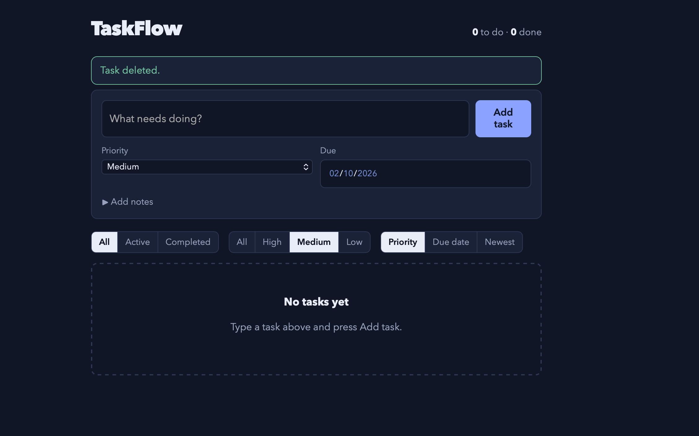

# TaskFlow

A personal task manager. Create, edit, complete, prioritise and delete tasks, then filter them by status and priority. Built with Flask and SQLite, with a responsive HTML/CSS interface and no JavaScript framework.


<p align="center">
  
</p>


## Features

- Add tasks with a title, notes, priority (low, medium, high) and optional due date
- Edit and delete tasks; mark them done or reopen them
- Filter by status (all, active, completed) and priority
- Sort by priority, due date or newest
- Overdue tasks are highlighted
- Persistent storage in SQLite (created automatically on first run)
- Responsive layout with light and dark themes
- CSRF protection, parameterised SQL queries and server-side validation

## Getting started

```bash
git clone https://github.com/stackcraftio/taskflow.git
cd taskflow

python3 -m venv .venv
source .venv/bin/activate        # Windows: .venv\Scripts\activate
pip install -r requirements.txt

python3 -m flask --app app run --port 5001
```

Open <http://127.0.0.1:5001>.

Port 5001 is used because macOS reserves port 5000 for AirPlay Receiver.

For anything beyond local use, set your own secret key:

```bash
export SECRET_KEY="a-long-random-string"
```

## Running the tests

```bash
python3 -m unittest discover -s tests -v
```

## Project structure

```
taskflow/
├── app.py            # Flask app factory, routes, validation
├── db.py             # SQLite connection and schema
├── templates/        # Jinja2 templates (base, index, edit)
├── static/style.css  # Responsive styles
├── tests/            # Unit tests
└── .github/workflows # CI (runs tests on every push)
```

## Routes

| Method   | Path                 | Purpose                                 |
| -------- | -------------------- | --------------------------------------- |
| GET      | `/`                  | List tasks (`?status=&priority=&sort=`) |
| POST     | `/tasks`             | Create a task                           |
| GET/POST | `/tasks/<id>/edit`   | Edit a task                             |
| POST     | `/tasks/<id>/toggle` | Mark done / reopen                      |
| POST     | `/tasks/<id>/delete` | Delete a task                           |

## Roadmap

- [ ] Search tasks by keyword
- [ ] Tags or projects
- [ ] User accounts
- [ ] Export to CSV

## Licence

MIT. See [LICENSE](LICENSE). Copyright (c) 2026 YY.

